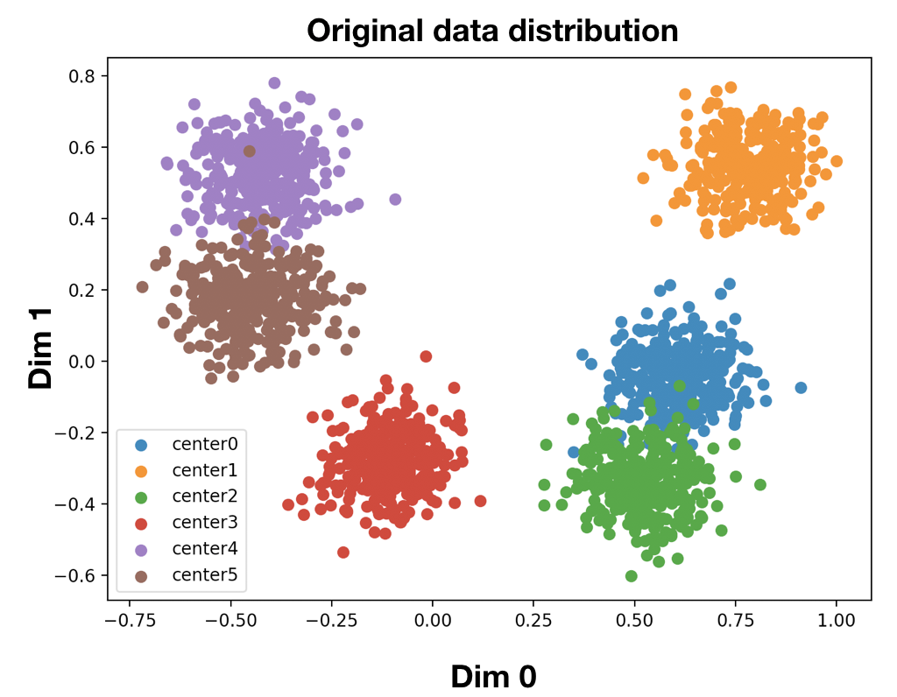
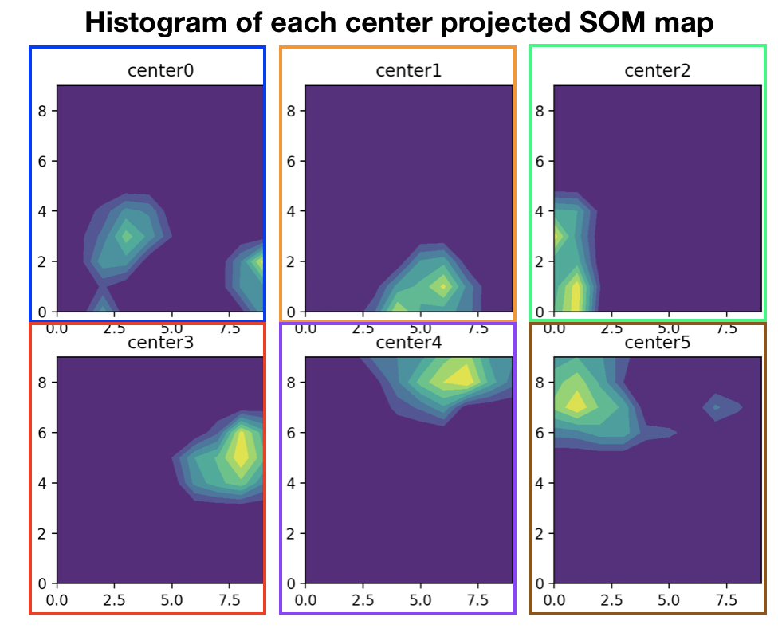
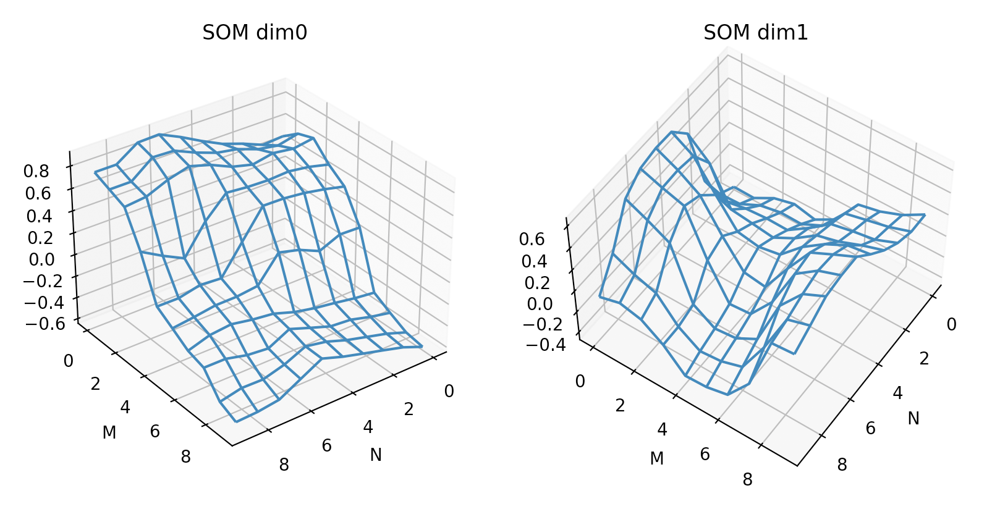
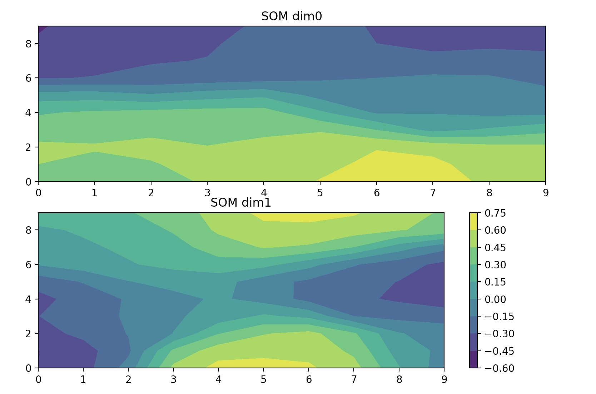

# **Clustering by SOM (pybind11 example)**
  ## **Motivation**
  - This is a big cost on generating a SOM clustering results due to the fact that SOM map was trainined by individual row by row data. Therefore, I tried to use pybind11 to reduce the runtime of slowest part in SOM, training SOM one by one in data. However, the final results show that SOM with dimension 10x10x2 by pybind11 speed up to 50 times faster than SOM by pure python.
   
  ## **Condition**
  - Generate datas by 6 centers of blobs in 2D for SOM clustering 
----
  ## **Reference**
  - https://stackabuse.com/self-organizing-maps-theory-and-implementation-in-python-with-numpy/

  ## **How to use API**
  > _**Training SOM**_
  ```python
    import SOM
    lr       = lr0 
    radius   = radius0 
    som_     = np.random.randint(0, 255, (m, n, c)).astype(float) / 255
    som_ *= 2
    som_ -= 1
    for ei in tqdm(range(epochs)):
        np.random.shuffle(data)
        som_c = SOM.clustering(som_, data, lr, radius, step)
        lr    = lr0 * np.exp(-ei * lr_decay)
        radius = radius0 * np.exp(-ei * radius_decay)        
  ```
parameters:

* ``data``: clustering data [N x c] 
* ``m/n/c``: SOM dimension [m x n x c]
* ``lr0``: learning rate 
* ``radius0``: sigma in radial distance function 
* ``step``: How many neighbor count of BMU(best matching unit) did SOM consider to link for training?


----
  ## **How to work**
  - Compile SOM.cpp
    - /usr/bin/g++ -O3 -Wall -shared -std=c++11 -fPIC `python3.9 -m pybind11 --includes` SOM.cpp -o SOM`python3.9-config --extension-suffix` `python3.9-config --ldflags` -undefined dynamic_lookup

  - Run python
    - python3.9 som_blobs.py
----
  ## **Results**
  - 
  - 
  - 
  - 

