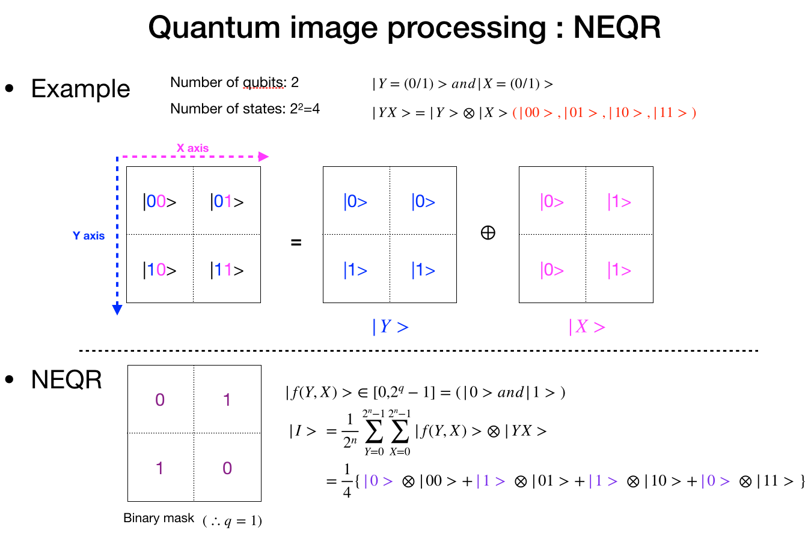
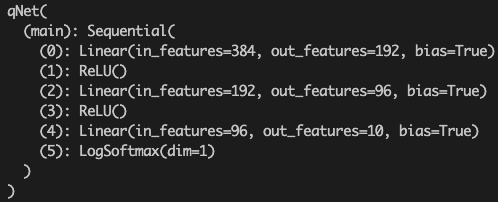

# **Quantum Image process(QIMP)**
 ## Introduce:  
*  **Goal**
   * Encode MNIST image by 2D image to another latent space by QIMP in order to reduce feature dimension from 784 to 384  
   * Use latent space to classify the MNIST data
   * Without using quantum-computing software in the webside in order to forbid error correct on quantum process
*  **Algorithm**
   * NEQR (Novel Enhanced Quantum Representation)
*  **Data**  
   * MNIST
*  **Parameter**
   * 10 qubits to describe image localtion
   * 4  qubits to describe image value
   * total qubits 10+3=13
   * epochs = 20
   * lr     = 0.002
   * batch_size = 32 -> 64 -> 128  
*  **Results**
   * Accuracy of 0: 0.823529
   * Accuracy of 1: 0.978261
   * Accuracy of 2: 0.857143
   * Accuracy of 3: 0.842105
   * Accuracy of 4: 0.825000
   * Accuracy of 5: 0.800000
   * Accuracy of 6: 0.933333
   * Accuracy of 7: 0.767442
   * Accuracy of 8: 0.615385
   * Accuracy of 9: 0.760870
*  **Reference**
   [NEQR paper](https://doi.org/10.1007/s11128-013-0567-z)
   [MNIST pytorch example](https://clay-atlas.com/blog/2019/10/19/pytorch-教學-getting-start-訓練分類器-mnist/)
   [MLP-Mixer](https://arxiv.org/abs/2105.01601)
## Describe
*  **NEAR simple example**
   -  
*  **Mearsurement(with only numpy)**
   -   
  

